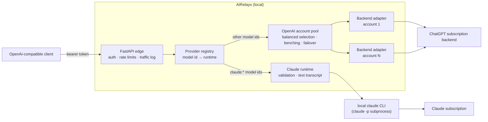
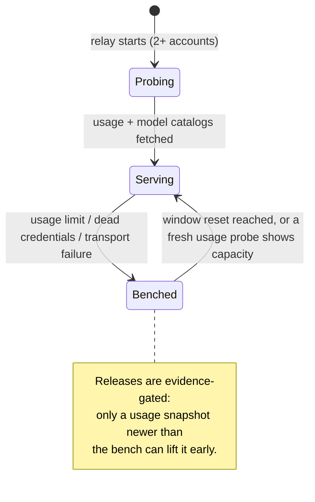

# Architecture

## Overview

AIRelays is an OpenAI-shaped edge over provider-specific local runtimes.

- The default runtime uses the ChatGPT Codex subscription backend and
  balances requests across every enrolled OpenAI account with capacity.
- The Claude runtime uses isolated local `claude -p` subprocesses.

## Request Flow

1. FastAPI receives an OpenAI-shaped request.
2. Middleware enforces relay auth and local abuse controls.
3. AIRelays resolves the request model id to a provider runtime.
4. Claude-specific validation and invocation stay inside the Claude runtime, while the OpenAI runtime currently uses shared request/response transforms plus the OpenAI backend adapter.
5. On the OpenAI runtime, the account pool picks the account: conversation affinity first, then — among accounts with capacity that serve the requested model — the one with the most remaining short-window quota (`balance = "balanced"`, the default), strict rotation (`"round_robin"`), or the first such account (`"ordered"`). Account-scoped failures (usage limits, dead credentials, transport errors) bench the account until it recovers and fail over to the next one — only before the first byte reaches the client.
6. The selected runtime returns streamed or aggregated output in the matching OpenAI-shaped envelope.
7. AIRelays logs the request, runtime selection, account selection, and result.

## Account Pool Lifecycle

At launch, a multi-account pool probes each account's usage and model
catalog in the background, so accounts already at their limit are benched
and model-aware balancing works from the first request.

## Main Components

### `airelays.config`

- config resolution
- local paths
- relay token state
- provider toggles and runtime guardrails

### `airelays.security`

- relay bearer auth
- per-IP limits
- temporary bad-token blocks

### `airelays.auth`

- AIRelays-owned OpenAI subscription auth
- browser and device login
- token refresh

### `airelays.accounts`

- multi-account discovery and storage slots
- balanced account selection (capacity-aware default; round-robin and ordered opt-ins)
- usage-limit benching with evidence-gated release
- cached, single-flighted usage probes with a background refresher
- account failover and launch-time capacity/model warm-up

### `airelays.backend`

- OpenAI runtime HTTP calls to the verified ChatGPT backend
- structured errors for upstream HTTP and transport failures

### `airelays.providers`

- provider registry
- provider model catalogs
- provider readiness
- Claude runtime

### `airelays.transforms`

- OpenAI runtime request and response translation

### `airelays.store`

- local files
- local OpenAI conversation state

### `airelays.traffic`

- redacted JSONL logging

## State Model

OpenAI runtime:

- supports AIRelays local conversations
- supports local file reuse

Claude runtime:

- stateless only
- no local conversation reuse
- no file reuse

## Intentional Boundaries

- no silent fallback across providers
- no blanket parity claim across providers
- no silent truncation
- no fake token budgets
- no reuse of upstream subscription auth as relay-client auth
